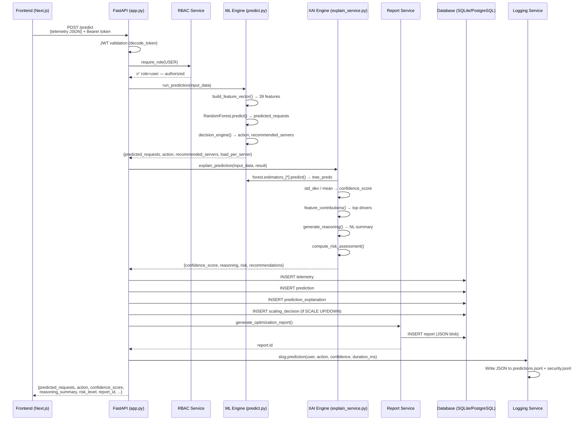
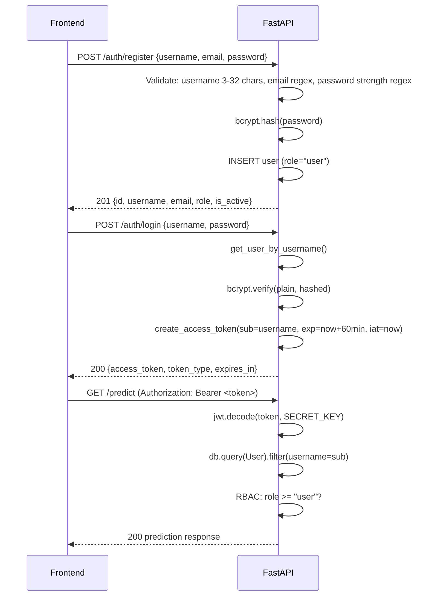
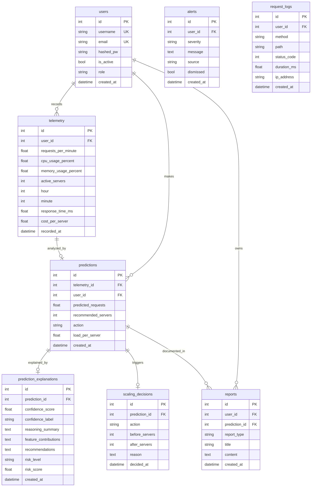

# CloudMind AI — Data Flow

## End-to-End Prediction Flow



## Authentication Flow



## Report Generation Flow

```mermaid
flowchart LR
    P[POST /predict] --> ML[ML Prediction]
    ML --> XAI[XAI Explanation]
    XAI --> DB1[(predictions table)]
    XAI --> DB2[(prediction_explanations table)]
    ML --> RPT[Report Service]

    RPT --> R1[generate_optimization_report\ncombines prediction + XAI]
    RPT --> R2[generate_cost_report\ncalculates savings/overhead]

    R1 --> DB3[(reports table\nJSON blob)]
    R2 --> DB3

    DB3 --> E1[GET /reports]
    DB3 --> E2[GET /reports/{id}]
    DB3 --> E3[GET /reports/export/json]
    DB3 --> E4[GET /reports/export/csv]
```

## Database Schema Relations


